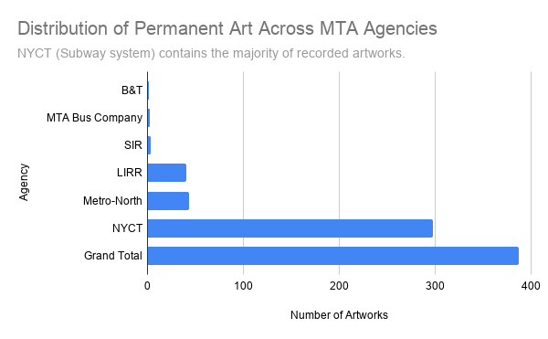
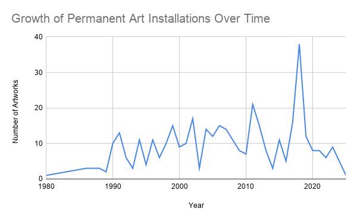

# Permanent Art in New York's Transit System is Concentrated in the NYC Subway

## This project uses the MTA Permanent Art Catalog dataset to analyze the distribution of permanent public artworks across the New York City Transit System. The goal is to study the distribution of public art across transit angencies and throughout time.

### Dataset Source and its Evaluation
This project uses the MTA Permanent Art Catalog dataset from the New York State Open Data Portal [MTA Permanent Art Catalog: Beginning 1980](https://data.ny.gov/Transportation/MTA-Permanent-Art-Catalog-Beginning-1980/4y8j-9pkd/about_data).
The dataset is generated by the Metropolitan Transportation Authority (MTA) and its Arts & Design program, which commissions and maintains permanent public artworks throughout the transit system, including subway stations, commuter rail lines, and related infrastructure. As a government-maintained dataset, it is generally reliable for the identification of officially installed permanent artworks. And the catalog's primary function is administrative and documentation as the MTA is a public transportation agency rather than interpretation or evaluation.

However, the dataset has some limitations. It only includes artworks that have been officially cataloged by the MTA Arts & Design program, it means temporary installations, unofficial artworks, and community-generated art are not included. As a result, the dataset represents a purposed selection rather than the full range of artistic activity in New York’s transit environment. In addition, the dataset does not contain any information regarding the artistic impact, cultural significance, or public reception. It also reflects the institution's decisions regarding which projects to commission and record, which introduces selection bias toward officially approved projects.

Overall, the dataset is beneficial for the analysis of patterns in officially recorded public art from a journalistic perspective. But it does not accurately reflect the full extent of public art in New York's transit system. In order to comprehend informal, unrecorded, or absent artistic contributions, additional sources would be necessary for further reporting.

### Data Analysis
This project analyzes the MTA Permanent Art Catalog, which comprises more than 380 officially documented artworks that have been installed throughout New York City's transit system. The analyzation here is mainly focused on categorical aggregation and arts trend over time. Here is the link: [MTA Permanent Art Catelog Dataset Google Sheet](https://docs.google.com/spreadsheets/d/1TvYbh9YQJdNyZXF4yfb-_EvMXx807A127qhn6G_4RI8/edit?usp=sharing)

The dataset need little cleaning before analysis. The important columns for analyzation are all completed without any null or empty values in it. There is only one "NA" appears in the "Art Description" column that has no effect on our analysis. So no major missing data imputation and data cleaning is required here.

For the first pivot table and its bar chart "Distribution Across Agencies". 

The dataset is grouped by agency type and the number of artworks in each group is obtained using a COUNTA aggregation of artwork titles. This enabled a comparison of the distribution of public art across different transit systems, such as NYCT, LIRR and Metro-North. The numbers obtained are then represented as a bar chart in order to make discrepancies in distribution more readily obvious. The technique shows a highly irregular distribution of permanent artworks within the NYC Subway system compared to other transit agencies.

A key finding is that the NYC Subway system (NYCT) dominates the dataset, containing the majority of those recorded artworks. In contrast, commuter rail systems such as the Long Island Rail Road (LIRR) and Metro-North have significantly fewer installations, and smaller agencies such as the Staten Island Railway (SIR) and MTA Bus have only several artworks. This suggests that the permanent art is not evenly distributed across transit modes, instead, it heavily prioritizes high-traffic urban subway spaces where visibility and public exposure are the highest.

For the second pivot table and its line chart "Growth Over Time". 

This pivot table is grouped by year and use A COUNTA aggregate to calculate the number of artworks installed in each year. A line chart was used to show the generated time-series data in order to spot trends and variations across time. This approach makes it feasible to observe the trend, showing a cyclical tendency.

The results show that artwork installations are not evenly distributed over the time. The line is not perfectly linear or stable, instead, it fluctuates significantly across years, and there are periods of higher artistic activity followed by slower periods. Another notable finding is a significant increase in installations in 2018 and reach the peak among these years, this suggests that the program may have expanded or become more active in commissioning public art. It also reflects there might be some changes in funding cycles, transit development projects, or shifts in institutional priorities at that time.

### Summary
This project analyzed the MTA Permanent Art Catalog to understand how public art is distributed and how it has evolved over time within New York City’s transit system. By using two main visualizations, one that shows distribution among transit agencies and the other that shows trends over time, the analysis shows that permanent public artworks are not uniformly dispersed across the system. Instead, they are disproportionately concentrated in the NYC Subway system (NYCT). Commuter rail systems such as the Long Island Rail Road (LIRR) and Metro-North Railroad have much fewer installations. The historical analysis also reveals that the quantity of documented artworks fluctuates year to year, showing that the MTA Arts & Design program functions in cycles driven by funding, infrastructure projects, and institutional goals.Overall, the data imply that public art in the MTA system is influenced not only by artistic decisions but also by structural and institutional considerations. Subways, with their great exposure and massive passenger flow, seem to attract most of the artistic investment, acting as a transit center and a cultural area.

But, this dataset has serious limitations that need to be highlighted. First, the dataset only covers permanent works of art that were commissioned or documented by the MTA Arts & Design program and legally recorded. That means ephemeral installations, community-based artworks, informal creative expressions and unlicensed art (such as graffiti or street art) are excluded. As a result, the dataset presents a curated and institutionally filtered version of public art in New York City rather than a complete representation of all artistic activity within transit spaces. Also, this contains a kind of institutional bias. The data collection reflects what the MTA chose to fund, commission and publicly document—not all the art that exists. The results derived from this data set speak to institutional goals, not the entire cultural environment of public art in New York City. The dataset only includes recorded installations and may be biased against earlier works that were not fully recorded or works that have been removed or changed over time.

In addition, from an ethical perspective, such analysis does not entail personal data or sensitive information at the individual level. However, there is still a responsibility to avoid overgeneralizing the findings. For example, the concentration of artworks in the subway system should not be seen as proof of variations in cultural value among transit communities but rather as a byproduct of institutional decision-making processes and infrastructure objectives.

In order to make this analysis more complete and ethically robust, additional reporting is necessary. This could include qualitative research on how MTA Arts & Design selects locations and artists, interviews with program administrators or artists, and comparative analysis with other public art programs outside the MTA system. It would also be valuable to incorporate data on temporary installations or community-based art projects to provide a more holistic view of public art in New York City.

Last but not least, this dataset provides valuable insights about the distribution and history of permanent public art throughout the MTA system, it represents only a partial view shaped by institutional documentation practices. A more nuanced understanding of public art in transit places would entail the inclusion of diverse data sources and opinions outside of the official catalog.
